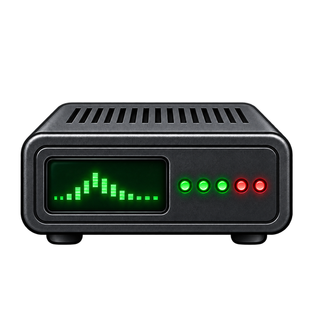
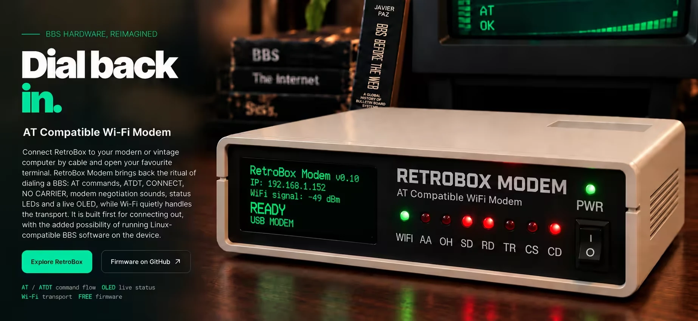
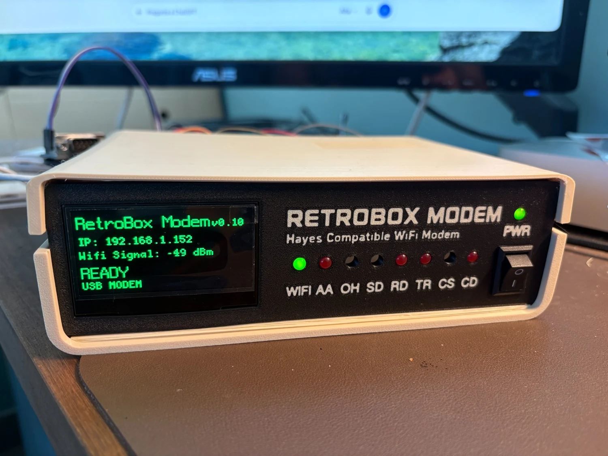
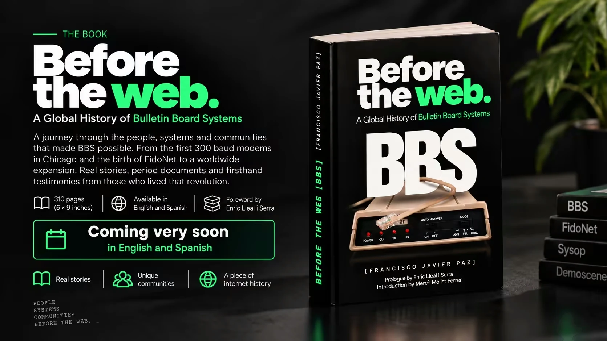

  

<h1 align="center">RetroBox Modem</h1>

  <strong>A modern Wi‑Fi modem built to bring the BBS experience back.</strong> 
  AT commands · modem sounds · status LEDs · live OLED · vintage and modern computers

  <a href="https://retroboxmodem.com/">Official website</a> ·
  <a href="https://retroboxmodem.com/#newsletter">Project updates</a> ·
  <a href="https://www.youtube.com/@retroboxmodem">YouTube</a>

---

  

## What is RetroBox Modem?

RetroBox Modem is a hardware and software project that recreates the ritual of connecting to a Bulletin Board System without requiring a telephone line.

Connect RetroBox to a modern or vintage computer, open a communications terminal and use familiar modem commands such as `AT` and `ATD`. RetroBox handles the network connection over Wi‑Fi while restoring the parts of the experience that made dialing a BBS feel physical: connection sounds, status LEDs, modem responses and a live OLED display.

The project is being developed around a working physical prototype.

## What it is designed to do

- Connect modern and vintage computers to Internet-accessible BBSs.
- Recreate the classic `AT` / `ATD` modem command flow.
- Return familiar responses such as `OK`, `CONNECT` and `NO CARRIER`.
- Play speed-specific dialing and handshake audio from 300 baud through later modem standards.
- Display live connection, IP, Wi‑Fi and modem status on an OLED screen.
- Provide front-panel activity indicators.
- Support escape-to-command mode with `+++` and return online with `ATO`.
- Provide a path toward Auto Answer and running Linux-compatible BBS software on the device itself.

Support and connection requirements vary by computer. Current development includes PCs, Macs and Amigas, with additional retro platforms being explored.

## Current prototype

  

RetroBox Modem already exists as a working prototype combining the enclosure, Raspberry Pi platform, OLED interface, front-panel LEDs, modem firmware, Wi‑Fi connectivity and audio.

The hardware and firmware are still being developed and tested. Features, supported platforms and kit contents may change before release.

## Firmware

**The firmware source is not public yet.**

A public firmware release is planned when the project is ready for broader use and documentation. This repository is currently a public project overview only; it does **not** contain the private development source code.

When firmware is released, this page will link directly to the public source, releases, setup documentation and licensing information.

## The book *BBS Before the Web*

  

RetroBox Modem brings back the experience of connecting to a BBS.

**The book *BBS Before the Web*** documents the global history of Bulletin Board Systems: their networks, sysops, communities and the people who built an online world before the Web became mainstream.

The book and the modem are two parts of the same wider project to preserve and revisit the BBS era, but the book is **not** the story of how RetroBox Modem was developed.

The first edition is planned in English and Spanish.

- [Book section on retroboxmodem.com](https://retroboxmodem.com/#book)
- [Spanish website](https://retroboxmodem.com/es/)
- [Get book and project updates](https://retroboxmodem.com/#newsletter)

## Project status

| Area | Status |
| --- | --- |
| Physical prototype | Working prototype |
| AT command flow | In active development |
| BBS connections over Wi‑Fi | Working / being expanded and tested |
| OLED status interface | Working prototype |
| Front-panel LEDs | Working prototype |
| Modem connection audio | In active development |
| Auto Answer / hosting a BBS | Planned for launch version, under development |
| Public firmware source | Coming later |
| Enclosure / hardware pack | Planned; final contents and price not announced |
| *The book BBS Before the Web* | In preparation |

## Follow the project

- Website: **https://retroboxmodem.com/**
- YouTube: **https://www.youtube.com/@retroboxmodem**
- Updates / Founders list: **https://retroboxmodem.com/#newsletter**
- Book: **https://retroboxmodem.com/#book**

The first 60 valid subscribers who complete email confirmation are planned to receive Founders Offer information in confirmation order when the hardware pack details are ready. Joining the list is not an order or a commitment.

## Repository status

This repository is intentionally informational for now.

No private firmware, credentials, production configuration, subscriber data, analytics data or deployment secrets are included here.

The development repository remains private while the firmware, hardware support and documentation are being prepared for public release.

---

  <strong>Dial back in.</strong> 
  <a href="https://retroboxmodem.com/">retroboxmodem.com</a>

